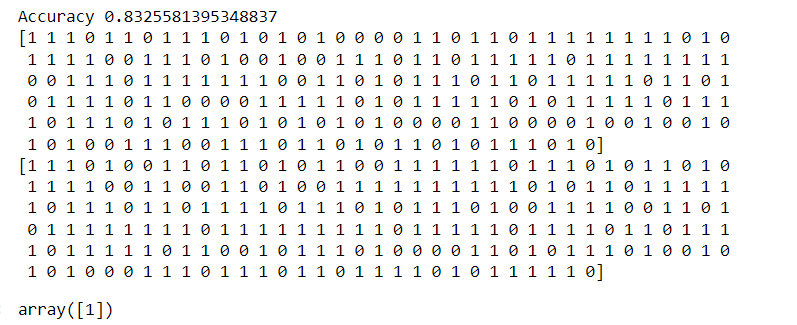

# Implementation-of-Logistic-Regression-Using-Gradient-Descent

## AIM:
To write a program to implement the the Logistic Regression Using Gradient Descent.

## Equipments Required:
1. Hardware – PCs
2. Anaconda – Python 3.7 Installation / Jupyter notebook

## Algorithm

## Step 1:
Import the necessary python packages

## Step 2:
Read the dataset.

## Step 3:
Define X and Y array.

## Step 4:
Define a function for costFunction,cost and gradient.

## Step 5:
Define a function to plot the decision boundary and predict the Regression value

Program:
## Program:
```
/*
Program to implement the the Logistic Regression Using Gradient Descent.
Developed by: JISHNUPRIYAN S
RegisterNumber: 212223240061 
*/
import pandas as pd
import numpy as np
import matplotlib.pyplot as plt

df=pd.read_csv("Placement_Data.csv")
df

df=df.drop("sl_no",axis=1)
df=df.drop("salary",axis=1)
df

from sklearn.preprocessing import LabelEncoder
le=LabelEncoder()
df["gender"]=df["gender"].astype('category')
df["ssc_b"]=df["ssc_b"].astype('category')
df["hsc_b"]=df["hsc_b"].astype('category')
df["hsc_s"]=df["hsc_s"].astype('category')
df["degree_t"]=df["degree_t"].astype('category')
df["workex"]=df["workex"].astype('category')
df["specialisation"]=df["specialisation"].astype('category')
df["status"]=df["status"].astype('category')
df.dtypes

df["gender"]=df["gender"].cat.codes
df["ssc_b"]=df["ssc_b"].cat.codes
df["hsc_b"]=df["hsc_b"].cat.codes
df["hsc_s"]=df["hsc_s"].cat.codes
df["degree_t"]=df["degree_t"].cat.codes
df["workex"]=df["workex"].cat.codes
df["specialisation"]=df["specialisation"].cat.codes
df["status"]=df["status"].cat.codes
df

X=df.iloc[:,:-1].values
Y=df.iloc[:,-1].values
Y

theta = np.random.random(X.shape[1])
y=Y

def sigmoid(z):
    return 1/(1+np.exp(-z))

def loss(theta,X,y):
    h=sigmoid(X.dot(theta))
    return -np.sum(y*np.log(h)+(1-y)*log(1-h))

def gradient_descent(theta, X,y, alpha, num_iterations):
    m=len(y)
    for i in range(num_iterations):
        h=sigmoid(X.dot(theta))
        gradient=X.T.dot(h-y)/m
        theta-= alpha*gradient
    return theta


theta = gradient_descent(theta,X,y,alpha = 0.01, num_iterations = 1000)

def predict(theta, X):
    h= sigmoid(X.dot(theta))
    y_pred=np.where(h>=0.5,1,0)
    return y_pred
y_pred=predict(theta,X)
y_pred


accuracy = np.mean(y_pred.flatten()==y)
print("Accuracy",accuracy)

print(y_pred)

print(Y)

xnew= np.array([[0,87,0,95,0,2,0,0,1,0,0,0]])
y_prednew=predict(theta,xnew)
y_prednew
```

## Output:



## Result:
Thus the program to implement the the Logistic Regression Using Gradient Descent is written and verified using python programming.

